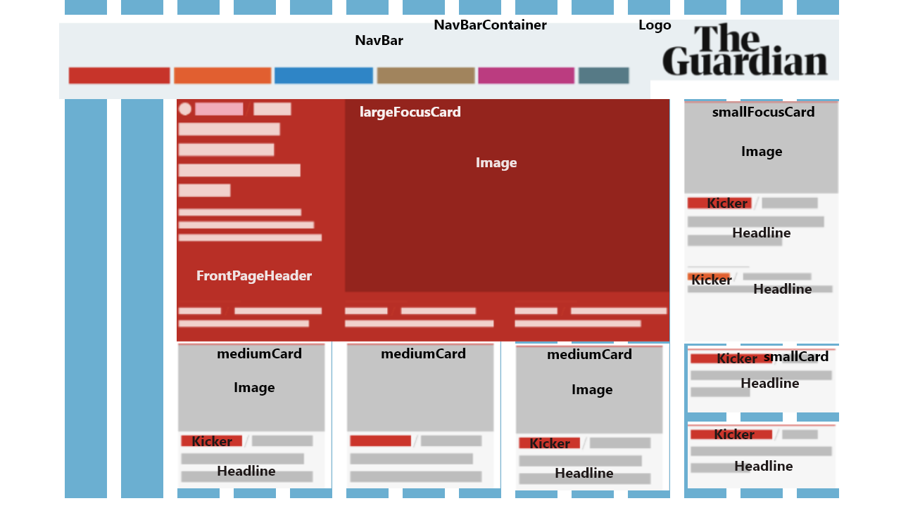
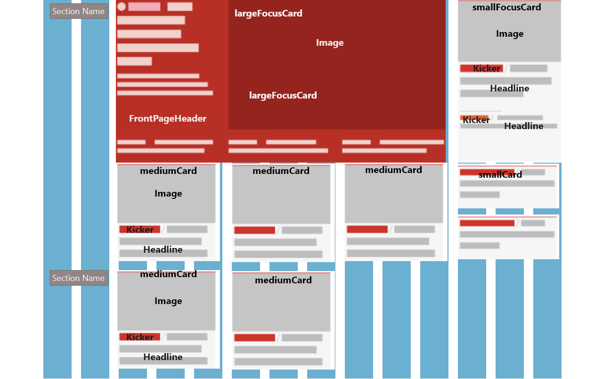

# the_guardian_mockup

# Homework: W1: Journalism - The Guardian [Mockup]
##### Mockup of a news page of The Guardian
# 
# Wireframe

##### 

##### 
##### 
### Features: 
#### Main focus: articles rendering using functional components.
#### Layout technology: Grid & Flexbox
#####    News source: The Guardian Open API
#####       Some archives are used to overcome the limit of 10 news items per query
#### News sections created: 
#####    Headlines, Sport, Arts (These have relatively more news items on hand)
#####    News sections are sorted by the PillarName field and put in corresponding sections
#####    Placeholder images are sorted by categories and inserted into each section.
#### News Card types created:
#####    Large focus cards: holds 4 news items 
#####    Small focus cards: holds 2 news items. One has an image.
#####    Medium cards: holds 1 news items along with an image.
#####    Small cards: holds 2 news items, but no image.
#####    
#####    Headline news section (Front page) has a large focus card and small focus card, a few medium cards and small cards, depending on the amount of news data items.
##### 
#####    Other sections may also have a large focus card and a small focus card depending on the amount of news items.
#####    If there are only small amount of news items, only medium cards and small cards will be used.